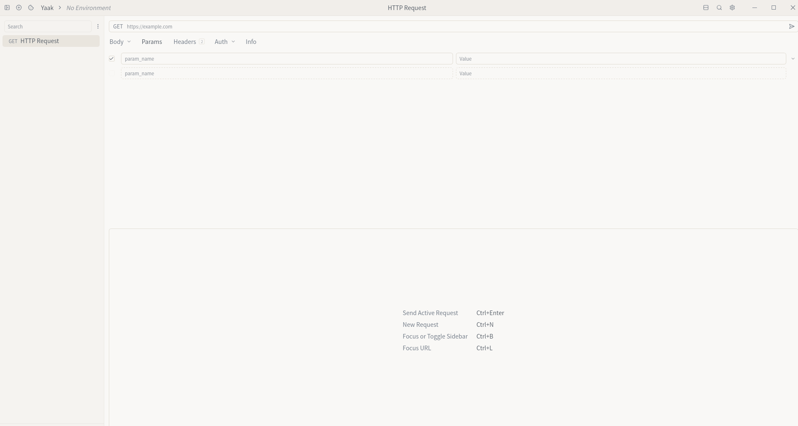

# PostMan替代工具 (Rust实现)

一个使用Rust和gpui框架构建的PostMan替代工具，提供API测试、环境变量管理、历史记录等功能。

[中文](#postman替代工具-rust实现)

## 📋 项目概述

PostMan替代工具是一个使用Rust语言和gpui框架构建的开源API测试工具，旨在提供与PostMan类似的功能体验。该项目强调性能、跨平台兼容性和现代化的用户界面。

## ✨ 功能特性

### 🌐 HTTP请求与响应预览
- 支持GET、POST、PUT、DELETE、PATCH、HEAD、OPTIONS等HTTP方法
- 实时查看请求和响应内容
- JSON格式化与语法高亮
- 响应头详细展示
- 状态码和响应时间统计

### 🔧 环境变量管理
- 支持全局和局部环境变量
- 变量替换功能：`{{variable_name}}`
- 环境切换快捷方式
- 变量导入/导出功能

### 📋 快捷复制请求
- 快捷复制请求为cURL命令
- 快捷复制cURL为请求
- 生成各种编程语言代码（Python、JavaScript、Go、Rust等）
- 复制请求头、请求体
- 分享功能支持

### 🔄 cURL导入
- 粘贴cURL命令自动解析为请求
- 智能识别请求方法、URL、头部和主体
- 支持复杂cURL命令解析

### 📊 历史记录
- 自动保存请求历史
- 支持快速查看和重放历史请求
- 历史记录搜索功能
- 按时间、状态码、方法过滤

### 🎨 主题切换
- 支持亮色/暗色主题切换
- 自定义主题颜色
- 使用gpui框架构建原生GUI应用
- 界面布局参考PostMan，直观易用

### 🌍 多语言支持
- 支持中文和英文界面切换
- 国际化框架支持
- 本地化资源管理

### 🖥️ UI界面
- 现代化美观的界面设计
- 响应式布局适应不同屏幕尺寸
- 拖拽式界面元素
- 可自定义工作区布局
- UI效果图:

### 💾 数据持久化
- 使用SQLite保存请求历史、环境变量等数据
- 自动备份和恢复
- 数据导入/导出功能

## 🛠️ 技术栈

### 核心框架
- **Rust**: 系统级编程语言，提供高性能和内存安全
- **gpui**: 基于Zed编辑器的GUI框架，提供原生跨平台体验
- **tokio**: Rust异步运行时，支持并发请求处理

### HTTP处理
- **reqwest**: Rust HTTP客户端库
- **url**: URL解析和处理
- **headers**: HTTP头处理

### 数据持久化
- **rusqlite**: SQLite数据库绑定
- **serde**: 序列化和反序列化框架
- **chrono**: 日期和时间处理

### 辅助工具
- **uuid**: UUID生成
- **regex**: 正则表达式处理
- **arboard**: 剪贴板操作
- **config**: 配置管理

### 国际化
- **i18n-embed**: 国际化支持
- **rust-embed**: 嵌入式资源管理

## 📦 安装与构建

### 系统要求
- Rust 1.70或更高版本
- Cargo包管理器
- SQLite 3.30+（已包含在rusqlite中）

### 从源码构建

1. 克隆仓库：
```bash
git clone https://github.com/yourusername/apipost-rs.git
cd apipost-rs
```

2. 安装依赖并构建：
```bash
cargo build --release
```

3. 运行应用程序：
```bash
cargo run --release
```

### 安装到系统

```bash
cargo install --path .
```

## 🚀 使用方法

### 启动应用程序
```bash
apipost-rs
```

### 基本功能

1. **创建新请求**：
   - 选择HTTP方法（GET、POST等）
   - 输入URL地址
   - 添加请求头和请求体
   - 点击"发送"按钮

2. **使用环境变量**：
   - 在设置中创建环境变量
   - 在URL或请求体中使用`{{variable_name}}`语法
   - 切换不同环境配置文件

3. **查看历史记录**：
   - 左侧边栏查看历史请求
   - 点击历史记录快速重放
   - 使用搜索功能查找特定请求

4. **导入cURL命令**：
   - 复制cURL命令到剪贴板
   - 点击"导入cURL"按钮
   - 自动填充请求信息

### 快捷键

| 快捷键 | 功能 |
|--------|------|
| Ctrl+S | 发送请求 |
| Ctrl+N | 新建请求 |
| Ctrl+H | 查看历史 |
| Ctrl+E | 环境变量 |
| Ctrl+T | 切换主题 |
| Ctrl+L | 切换语言 |

## 📁 项目结构

```
apipost-rs/
├── src/                    # 源代码目录
│   ├── main.rs            # 应用程序入口点
│   ├── app/               # 应用程序逻辑
│   │   ├── mod.rs
│   │   ├── database.rs    # 数据库操作
│   │   ├── request.rs     # 请求处理
│   │   ├── response.rs    # 响应处理
│   │   ├── environment.rs # 环境变量管理
│   │   └── history.rs     # 历史记录管理
│   ├── ui/                # 用户界面组件
│   │   ├── mod.rs
│   │   ├── components/    # UI组件
│   │   └── themes/        # 主题定义
│   ├── http/              # HTTP客户端
│   │   ├── mod.rs
│   │   ├── client.rs      # HTTP客户端实现
│   │   └── curl_parser.rs # cURL解析器
│   ├── config/            # 配置管理
│   └── i18n/              # 国际化资源
├── tests/                 # 测试文件
├── assets/                # 静态资源
│   ├── icons/             # 图标文件
│   └── translations/      # 翻译文件
├── migrations/            # 数据库迁移
├── Cargo.toml            # 项目配置
├── Cargo.lock            # 依赖锁定
└── README.md             # 项目说明
```

## ⚙️ 配置

### 配置文件位置
- Linux: `~/.config/apipost-rs/config.toml`
- macOS: `~/Library/Application Support/apipost-rs/config.toml`
- Windows: `%APPDATA%\apipost-rs\config.toml`

### 配置示例
```toml
[general]
language = "zh-CN"
theme = "dark"
auto_save = true
timeout = 30

[proxy]
enabled = false
url = "http://proxy.example.com:8080"

[database]
path = "~/.local/share/apipost-rs/database.db"
backup_interval = 3600
```

## 🧪 测试

### 运行单元测试
```bash
cargo test
```

### 运行集成测试
```bash
cargo test --test integration
```

### 重要功能测试用例

#### HTTP请求测试
```rust
#[cfg(test)]
mod tests {
    use super::*;
    
    #[test]
    fn test_send_get_request() {
        // 测试GET请求
    }
    
    #[test]
    fn test_variable_replacement() {
        // 测试环境变量替换
    }
    
    #[test]
    fn test_curl_import() {
        // 测试cURL导入功能
    }
}
```

### 性能测试
```bash
cargo bench
```

### 开发规范
- 遵循Rust编码规范
- 添加适当的注释（特别是中文注释）
- 为新功能添加测试用例
- 更新相关文档

### 代码结构要求
1. **模块化设计**：功能模块分离清晰
2. **错误处理**：使用anyhow和thiserror进行统一错误处理
3. **异步处理**：合理使用tokio异步任务
4. **数据持久化**：SQLite数据库操作封装
